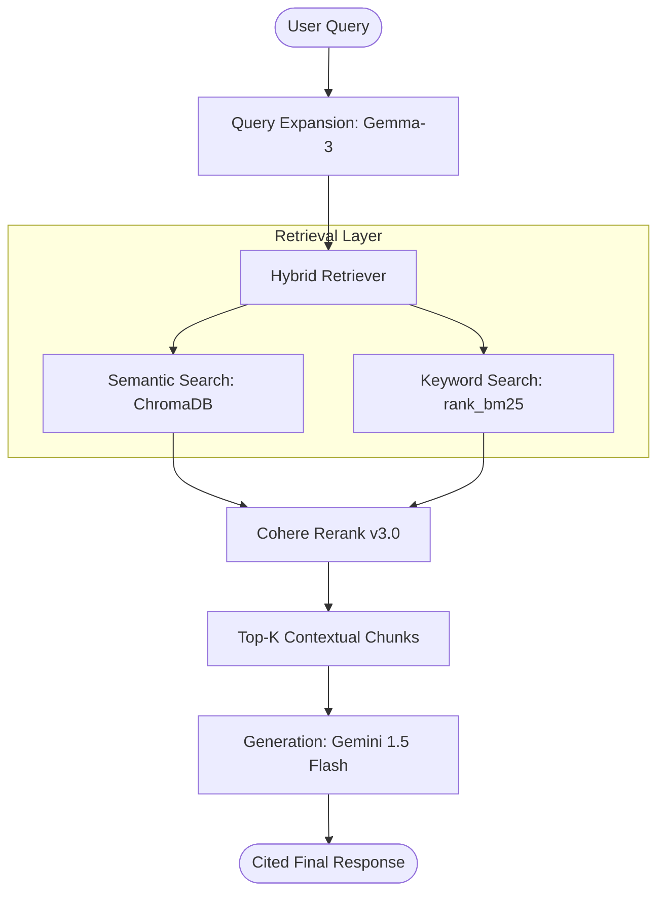

---

# SatCom Intelligence Agent

A production-grade Retrieval-Augmented Generation (RAG) system designed to query the Indian Satellite Communication Regulatory Policy. This project implements a modular architecture to solve common retrieval challenges in technical and regulatory documentation, validated by automated evaluation metrics.

## System Architecture

The system follows a multi-stage pipeline to ensure high faithfulness and minimize hallucinations.

## Core Features

- **Hybrid Retrieval:** Integrates semantic vector search with BM25 keyword matching to accurately capture domain-specific technical terminology (e.g., GMPCS, INSAT, CAISS).
- **Query Expansion:** Utilizes Gemma-3-27b to transform underspecified user prompts into optimized search queries.
- **Reranking:** Employs Cohere’s cross-encoder to resolve semantic relevance before generation, reducing noise in the context window.
- **Automated Evaluation:** Integrated with Ragas to measure Faithfulness, Answer Correctness, and Context Recall as part of the CI/CD pipeline.
- **Persistent Storage:** Local ChromaDB implementation with conditional loading to reduce system initialization cold starts.

## Technical Stack

- **Orchestration:** LangChain
- **Models:** Google Gemini 1.5 Flash (Generation), Gemma-3-27b (Expansion), Cohere (Reranking)
- **Vector Database:** ChromaDB
- **Embeddings:** HuggingFace all-MiniLM-L6-v2
- **Infrastructure:** GitHub Actions (CI/CD), Hugging Face Spaces (Deployment)

## Performance Metrics (Baseline v1.0.0)

Evaluated using a synthesized "Golden Dataset" of 50 ground-truth question-answer pairs.

| Metric | Score | Note |
| :--- | :--- | :--- |
| Faithfulness | 1.00 | Zero instances of hallucination in baseline |
| Answer Correctness | 0.82 | High alignment with regulatory facts |
| Context Recall | 0.60 | Primary area for optimization in next release |

## Installation and Deployment

### Prerequisites
- Python 3.11+
- uv or pip

### Local Setup
1. Clone the repository:
   `git clone https://github.com/Siva-Sindhuja2646/RAGstage2.git`
2. Install dependencies:
   `pip install -r requirements.txt`
3. Configure environment variables in a `.env` file:
   - `GEMINI_API_KEY`
   - `CO_API_KEY`

### Deployment
This project is configured for Continuous Deployment. Pushing to the `main` branch triggers a GitHub Action that synchronizes the codebase with the Hugging Face Space.

## Known Challenges and Future Work

- **Recall Bottleneck:** The current context recall (0.60) suggests that standard recursive chunking misses surrounding context for complex regulatory clauses.
- **Proposed Optimization:** Transitioning to Parent Document Retrieval (Small-to-Big) to store smaller retrieval units while providing the LLM with broader context windows.
- **Self-Correction:** Implementing a rerank-score threshold to proactively inform users when the knowledge base does not contain sufficient information.

---
